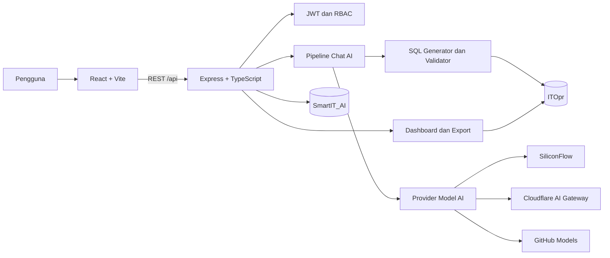

# Smart IT Assistant — PT Voksel Electric Tbk

<p align="center">
  
</p>

<p align="center">
  Dashboard operasional dan asisten AI internal untuk membantu tim IT mencari, menganalisis, memvisualisasikan, dan mengekspor data perusahaan melalui percakapan berbahasa Indonesia.
</p>

<p align="center">
  
  
  
  
  
</p>

> [!IMPORTANT]
> Proyek ini dirancang untuk lingkungan internal perusahaan. Versi saat ini belum boleh langsung diekspos ke internet tanpa menyelesaikan checklist pada bagian [Keamanan](#keamanan).

## Daftar Isi

- [Tentang Aplikasi](#tentang-aplikasi)
- [Fitur Utama](#fitur-utama)
- [Arsitektur](#arsitektur)
- [Teknologi](#teknologi)
- [Struktur Proyek](#struktur-proyek)
- [Prasyarat](#prasyarat)
- [Instalasi dan Konfigurasi](#instalasi-dan-konfigurasi)
- [Menjalankan Aplikasi](#menjalankan-aplikasi)
- [Model AI dan Provider](#model-ai-dan-provider)
- [API](#api)
- [Database](#database)
- [Pengujian](#pengujian)
- [Deployment](#deployment)
- [Keamanan](#keamanan)
- [Troubleshooting](#troubleshooting)
- [Kontribusi](#kontribusi)
- [Lisensi](#lisensi)

## Tentang Aplikasi

Smart IT Assistant menggabungkan dashboard operasional dengan antarmuka chat berbasis AI. Pertanyaan pengguna dapat diterjemahkan menjadi kueri SQL yang divalidasi, dijalankan terhadap database operasional, kemudian ditampilkan sebagai jawaban, tabel, atau grafik interaktif.

Aplikasi menggunakan dua database Microsoft SQL Server dengan tanggung jawab berbeda:

- **`ITOpr`** — sumber data operasional perusahaan seperti karyawan, aset, tiket, dan work order.
- **`SmartIT_AI`** — penyimpanan akun aplikasi, percakapan, pesan, feedback, memori, dan pengetahuan yang dipelajari sistem.

## Fitur Utama

- Dashboard statistik karyawan, perangkat, tiket, work order, lisensi, CCTV, dan printer.
- Chat AI berbahasa Indonesia untuk pencarian dan analisis data operasional.
- Pembuatan SQL berbasis skema dengan validasi kueri sebelum eksekusi.
- Pemilihan beberapa model AI sesuai kebutuhan akurasi, kecepatan, dan biaya.
- Tabel data, Markdown, dan grafik interaktif menggunakan Recharts.
- Ekspor hasil kueri ke Microsoft Excel (`.xlsx`).
- Riwayat percakapan, pin percakapan, feedback jawaban, dan memori pengguna.
- Autentikasi JWT serta pembatasan operasi tertentu berdasarkan peran.
- Tampilan responsif, tema terang/gelap, dan antarmuka berbahasa Indonesia.
- Dukungan akses pengembangan atau production melalui ngrok.

## Arsitektur



Alur chat secara ringkas:

1. Pengguna mengirim pertanyaan dan memilih model.
2. Backend mengambil riwayat, memori, dan petunjuk kosakata yang relevan.
3. Model menyusun kueri berdasarkan skema yang diizinkan.
4. Validator menolak kueri berbahaya atau akses terhadap kolom sensitif.
5. Kueri aman dijalankan terhadap `ITOpr`.
6. Hasil diringkas dan dikembalikan sebagai teks, tabel, grafik, atau sumber ekspor.

## Teknologi

| Bagian | Teknologi |
| --- | --- |
| Frontend | React 19, TypeScript, Vite, Tailwind CSS 4 |
| UI dan visualisasi | Material UI, Lucide, Motion, Recharts |
| HTTP client | Axios |
| Backend | Node.js, Express 5, TypeScript |
| Database | Microsoft SQL Server, driver `mssql` |
| Autentikasi | JWT dan bcrypt |
| AI | OpenAI-compatible SDK, SiliconFlow, Cloudflare AI Gateway, GitHub Models |
| Ekspor | ExcelJS, XLSX, PDFKit, jsPDF |
| Validasi | Zod dan validator SQL internal |
| Development | ts-node-dev, concurrently, ngrok |

## Struktur Proyek

```text
.
├── backend/
│   ├── src/
│   │   ├── ai/             # Integrasi model, prompt SQL, skema, dan validator
│   │   ├── config/         # Koneksi dan bootstrap database
│   │   ├── controllers/    # Handler HTTP
│   │   ├── middlewares/    # Autentikasi dan error handler
│   │   ├── repositories/   # Akses data
│   │   ├── routes/         # Definisi endpoint REST
│   │   ├── services/       # Business logic dan pipeline chat
│   │   ├── tests/          # Test integrasi dan keamanan SQL
│   │   ├── types/          # Tipe domain backend
│   │   └── utils/          # Auth serta generator Excel/PDF
│   ├── package.json
│   └── tsconfig.json
├── frontend/
│   ├── assets/             # Logo dan aset visual
│   ├── components/         # Chat, dashboard, knowledge, dan layout
│   ├── pages/              # Login dan halaman utama
│   ├── services/           # Client REST API
│   ├── types/              # Tipe data frontend
│   ├── package.json
│   └── vite.config.ts
├── scripts/                # Utility database dan tunnel ngrok
├── DEPLOY.md               # Panduan deployment lebih rinci
└── package.json            # Orkestrasi script root
```

## Prasyarat

Pastikan lingkungan pengembangan menyediakan:

- **Node.js 20 LTS atau lebih baru** dan npm.
- **Microsoft SQL Server** yang dapat diakses melalui TCP/IP.
- Database operasional `ITOpr` dengan skema yang digunakan aplikasi.
- Database `SmartIT_AI` kosong atau yang sudah ada.
- Minimal satu kredensial provider AI sesuai model yang akan dipakai.
- Opsional: akun dan authtoken ngrok untuk membuat URL publik sementara.

Port bawaan:

| Layanan | Port | URL |
| --- | ---: | --- |
| Frontend development | `5173` | `http://localhost:5173` |
| Backend/API | `5000` | `http://localhost:5000` |
| SQL Server | `1433` | Ditentukan oleh konfigurasi database |

## Instalasi dan Konfigurasi

### 1. Clone dan instal dependensi

```bash
git clone <URL_REPOSITORY_ANDA>
cd smart-it-assistant-pt-voksel-electric-tbk
npm run install:all
```

`install:all` memasang dependensi root, backend, dan frontend.

### 2. Buat konfigurasi environment

Buat file `backend/.env`. Jangan pernah melakukan commit file ini.

```env
# Server
PORT=5000
APP_URL=http://localhost:5000

# Keamanan — wajib diganti dengan nilai acak yang panjang
JWT_SECRET=ganti-dengan-secret-acak-minimal-32-karakter
JWT_EXPIRES_IN=24h

# Database operasional ITOpr
DB_SERVER=alamat-sql-server
DB_PORT=1433
DB_DATABASE=ITOpr
DB_USER=pengguna-read-only
DB_PASSWORD=kata-sandi

# Database aplikasi SmartIT_AI
AI_DB_SERVER=alamat-sql-server
AI_DB_PORT=1433
AI_DB_DATABASE=SmartIT_AI
AI_DB_USER=pengguna-read-write
AI_DB_PASSWORD=kata-sandi

# Provider default: SiliconFlow
SILICONFLOW_TOKEN=

# Cloudflare AI Gateway — untuk model OpenAI/Anthropic/Google/Groq
CLOUDFLARE_ACCOUNT_ID=
CLOUDFLARE_API_TOKEN=
OPENAI_API_KEY=
ANTHROPIC_API_KEY=
GOOGLE_API_KEY=
GROQ_API_KEY=

# Fallback model dengan ID pendek melalui GitHub Models
GITHUB_MODELS_TOKEN=

# Opsional: tunnel publik
NGROK_AUTHTOKEN=
```

> [!NOTE]
> Anda tidak perlu mengisi seluruh API key. Isi hanya kombinasi variabel yang dibutuhkan oleh model pilihan. Model default saat ini menggunakan SiliconFlow dan membutuhkan `SILICONFLOW_TOKEN`.

### 3. Siapkan database

- Berikan akun `DB_USER` akses baca minimum terhadap tabel yang dibutuhkan di `ITOpr`.
- Buat database `SmartIT_AI` dan berikan `AI_DB_USER` izin baca/tulis serta izin membuat tabel.
- Saat backend pertama kali terhubung, tabel aplikasi di `SmartIT_AI` akan dibuat otomatis jika belum tersedia.
- Tinjau dan hapus atau ganti akun bootstrap bawaan sebelum production.

### 4. Verifikasi konfigurasi

Jalankan backend, lalu periksa health endpoint:

```bash
npm run dev:backend
```

```bash
curl http://localhost:5000/api/health
```

Respons yang diharapkan:

```json
{
  "success": true,
  "status": "ok",
  "timestamp": "2026-01-01T00:00:00.000Z"
}
```

## Menjalankan Aplikasi

### Development

Jalankan frontend dan backend bersamaan dari root proyek:

```bash
npm run dev
```

Atau gunakan dua terminal:

```bash
npm run dev:backend
```

```bash
npm run dev:frontend
```

Vite meneruskan seluruh request `/api` ke backend pada `http://localhost:5000`.

### Production lokal

```bash
npm run build
npm run start
```

Pada mode production, Express melayani API dan hasil build frontend melalui satu alamat: `http://localhost:5000`.

### Daftar script

| Perintah | Kegunaan |
| --- | --- |
| `npm run install:all` | Memasang seluruh dependensi |
| `npm run dev` | Menjalankan frontend dan backend bersamaan |
| `npm run dev:frontend` | Menjalankan Vite development server |
| `npm run dev:backend` | Menjalankan backend dengan auto-reload |
| `npm run build` | Build frontend dan backend |
| `npm run build:frontend` | Build frontend saja |
| `npm run build:backend` | Compile backend saja |
| `npm run start` | Menjalankan build production backend |
| `npm run tunnel` | Membuka tunnel production port `5000` |
| `npm run tunnel:dev` | Membuka tunnel development port `5173` |

## Model AI dan Provider

Daftar model yang tampil di antarmuka didefinisikan pada `frontend/components/chat/ModelSelector.tsx`. Routing provider dilakukan berdasarkan prefix ID model:

| Jenis model | Jalur provider | Environment yang diperlukan |
| --- | --- | --- |
| Qwen, DeepSeek, GLM, Step, GPT-OSS, dan prefix SiliconFlow lain | SiliconFlow langsung | `SILICONFLOW_TOKEN` |
| `openai/*` | Cloudflare AI Gateway → OpenAI | Cloudflare + `OPENAI_API_KEY` |
| `anthropic/*` | Cloudflare AI Gateway → Anthropic | Cloudflare + `ANTHROPIC_API_KEY` |
| `google-ai-studio/*` | Cloudflare AI Gateway → Google | Cloudflare + `GOOGLE_API_KEY` |
| `groq/*` | Cloudflare AI Gateway → Groq | Cloudflare + `GROQ_API_KEY` |
| ID pendek tanpa prefix khusus | GitHub Models | `GITHUB_MODELS_TOKEN` |

Model default backend adalah `Qwen/Qwen3-30B-A3B-Instruct-2507`.

## API

Seluruh endpoint menggunakan prefix `/api`. Selain login dan register, endpoint aplikasi saat ini melewati middleware autentikasi.

| Method | Endpoint | Keterangan |
| --- | --- | --- |
| `GET` | `/api/health` | Pemeriksaan status backend |
| `POST` | `/api/auth/login` | Login dan mendapatkan JWT |
| `POST` | `/api/auth/register` | Mendaftarkan pengguna |
| `GET` | `/api/auth/me` | Mendapatkan sesi pengguna aktif |
| `DELETE` | `/api/auth/users/:username` | Menghapus pengguna; khusus IT Support |
| `GET` | `/api/dashboard` | Statistik dashboard |
| `GET` | `/api/employees` | Daftar karyawan |
| `GET` | `/api/employees/:nik` | Detail karyawan |
| `GET` | `/api/assets` | Daftar aset |
| `GET` | `/api/assets/:id` | Detail aset |
| `GET` | `/api/tickets` | Daftar tiket |
| `GET` | `/api/tickets/:id` | Detail tiket |
| `GET` | `/api/workorders` | Daftar work order |
| `GET` | `/api/workorders/:id` | Detail work order |
| `POST` | `/api/chat` | Memproses pesan melalui pipeline AI |
| `POST` | `/api/feedback` | Menyimpan penilaian jawaban |
| `GET/POST` | `/api/conversations` | Membaca atau membuat percakapan |
| `DELETE` | `/api/conversations/:id` | Menghapus percakapan |
| `POST` | `/api/conversations/:id/pin` | Mengubah status pin percakapan |
| `GET` | `/api/conversations/:id/messages` | Membaca pesan percakapan |
| `GET/POST` | `/api/memories` | Membaca atau membuat memori pengguna |
| `DELETE` | `/api/memories/:id` | Menghapus memori |
| `POST` | `/api/export` | Mengekspor hasil kueri menjadi Excel |

Contoh request chat:

```bash
curl -X POST http://localhost:5000/api/chat \
  -H "Authorization: Bearer <JWT>" \
  -H "Content-Type: application/json" \
  -d '{
    "conversationId": "<UUID_PERCAKAPAN>",
    "messageText": "Tampilkan jumlah komputer aktif berdasarkan jenis",
    "model": "Qwen/Qwen3-30B-A3B-Instruct-2507"
  }'
```

## Database

### `ITOpr`

Database utama dipakai sebagai sumber data operasional. Dashboard perangkat menggunakan pemetaan berikut:

| Informasi | Sumber | Aturan utama |
| --- | --- | --- |
| Jenis perangkat | `TD_computer.Jenis` | PC, ALL IN ONE, dan NOTEBOOK |
| Status aset | `TD_computer.Aktif` | `Y` aktif, `N` tidak aktif, `P` usulan penghapusan |
| Penggunaan | `TD_computer.UserNama` | Terisi berarti memiliki pengguna |
| Usia | `TD_computer.CPU_RcptDate` | Dikelompokkan menjadi `≤ 6 tahun` dan `> 6 tahun` |
| Kondisi | `TD_computer.Check_List` | `Y` baik, nilai lain tidak baik |
| Perusahaan/lokasi | `TD_computer.perusahaan` | VOKSEL, PME, atau BPS |

Laporan penggunaan, usia, dan kondisi hanya menghitung perangkat aktif (`Aktif = 'Y'`).

### `SmartIT_AI`

Backend melakukan bootstrap tabel berikut:

- `AI_Conversation`
- `AI_Message`
- `AI_Feedback`
- `TD_MEMORY`
- `AI_LearnedWords`
- `AI_Knowledge`
- `TD_users`

Gunakan akun database terpisah untuk `ITOpr` dan `SmartIT_AI` agar prinsip least privilege tetap terjaga.

## Pengujian

Build penuh:

```bash
npm run build
```

Lint frontend:

```bash
npm run lint --prefix frontend
```

Test backend yang tersedia:

```bash
npm run test:safety --prefix backend
npm run test:dashboard --prefix backend
npm run test:complex --prefix backend
npm run test:computer --prefix backend
npm run test:database --prefix backend
npm run test:ai-sql --prefix backend
npm run test:openrouter --prefix backend
```

| Test | Cakupan |
| --- | --- |
| `test:safety` | Penolakan SQL berbahaya dan kolom sensitif |
| `test:dashboard` | Konsistensi kontrak statistik dashboard |
| `test:complex` | Pembuatan SQL dari pertanyaan kompleks |
| `test:computer` | Input-output data `TD_computer` |
| `test:database` | Input-output terhadap database perusahaan |
| `test:ai-sql` | Integrasi model untuk menghasilkan SQL |
| `test:openrouter` | Koneksi ke provider/model AI |

> [!NOTE]
> Sebagian test merupakan integration test dan memerlukan koneksi database atau API key aktif. Test tersebut bukan unit test yang sepenuhnya terisolasi.

## Deployment

Panduan deployment dengan PM2, Docker, serta langkah validasi production tersedia di [DEPLOY.md](DEPLOY.md).

Urutan minimum sebelum deployment:

```bash
npm run install:all
npm run build
npm run test:safety --prefix backend
npm run test:dashboard --prefix backend
npm run start
```

Untuk URL publik sementara:

```bash
npm run tunnel
```

Gunakan `tunnel:dev` hanya untuk pengembangan. Untuk penggunaan yang lebih stabil, build aplikasi dan arahkan tunnel ke server production port `5000`.

## Keamanan

Sebelum penggunaan production atau publik, selesaikan seluruh langkah berikut:

- [ ] Hapus kredensial database fallback yang masih tertulis di source code dan rotasi seluruh nilai yang pernah digunakan.
- [ ] Wajibkan `JWT_SECRET` dari environment; jangan gunakan secret fallback.
- [ ] Hapus fallback identitas development pada middleware autentikasi agar request tanpa JWT selalu ditolak.
- [ ] Ganti atau hapus akun administrator yang dibuat oleh proses bootstrap.
- [ ] Batasi endpoint register dan pengelolaan pengguna sesuai kebijakan perusahaan.
- [ ] Batasi CORS ke origin resmi; konfigurasi saat ini masih terbuka.
- [ ] Jalankan SQL Server melalui jaringan privat/VPN dan jangan membuka port `1433` ke internet publik.
- [ ] Gunakan akun `ITOpr` read-only dengan izin tabel/kolom minimum.
- [ ] Aktifkan enkripsi koneksi SQL Server dan jangan mengandalkan `trustServerCertificate` di production.
- [ ] Lindungi endpoint export dan pastikan hanya kueri tervalidasi yang dapat dieksekusi.
- [ ] Simpan secret di secret manager, bukan file atau riwayat Git.
- [ ] Tambahkan rate limiting, audit log, dan pengujian otorisasi sebelum go-live.
- [ ] Periksa ulang data sensitif sebelum membuat repositori menjadi public.

File `.gitignore` sudah mengecualikan `.env`, tetapi secret yang pernah masuk ke commit tetap harus dianggap bocor dan wajib dirotasi.

## Troubleshooting

### Frontend menampilkan `ECONNREFUSED` untuk `/api/*`

Backend belum berjalan pada port `5000`. Jalankan dari root:

```bash
npm run dev
```

Lalu periksa `http://localhost:5000/api/health`.

### Backend tidak dapat terhubung ke SQL Server

- Pastikan layanan SQL Server aktif.
- Aktifkan koneksi TCP/IP.
- Periksa host, port, database, username, dan password pada `backend/.env`.
- Pastikan firewall mengizinkan koneksi dari mesin aplikasi.
- Untuk server di luar jaringan kantor, gunakan VPN atau private network.

### Muncul pesan `Frontend build not found`

Build frontend belum tersedia. Jalankan:

```bash
npm run build
npm run start
```

### Model AI gagal merespons

- Pastikan API key sesuai dengan prefix model yang dipilih.
- Periksa apakah provider dapat diakses dari jaringan aplikasi.
- Pastikan ID model masih tersedia pada provider.
- Periksa log backend untuk status HTTP dan nama model yang gagal.
- Panggilan provider memiliki timeout, sehingga koneksi lambat dapat menghasilkan error.

### Sesi berakhir atau API merespons `401`

Token tidak valid atau sudah kedaluwarsa. Login kembali. Frontend akan membersihkan sesi lokal ketika menerima HTTP `401`.

### Tunnel ngrok gagal dibuat

- Isi `NGROK_AUTHTOKEN`.
- Pastikan server target sudah aktif sebelum menjalankan tunnel.
- Gunakan `npm run tunnel:dev` untuk Vite atau `npm run tunnel` untuk production.

## Kontribusi

1. Buat branch dari branch utama.
2. Lakukan perubahan kecil dan terfokus.
3. Jalankan build, lint, dan test yang relevan.
4. Jangan commit `.env`, token, password, dump database, atau data perusahaan.
5. Buat pull request dengan deskripsi perubahan dan bukti pengujian.

Contoh nama branch:

```text
feature/nama-fitur
fix/nama-perbaikan
docs/nama-dokumentasi
```

## Lisensi

Belum terdapat file lisensi pada root repositori. Secara default, kode ini tidak boleh dianggap sebagai open source. Hubungi pemilik proyek atau PT Voksel Electric Tbk untuk ketentuan penggunaan, distribusi, dan kontribusi.

---

<p align="center">
  Dikembangkan untuk mendukung operasional IT PT Voksel Electric Tbk.
</p>
